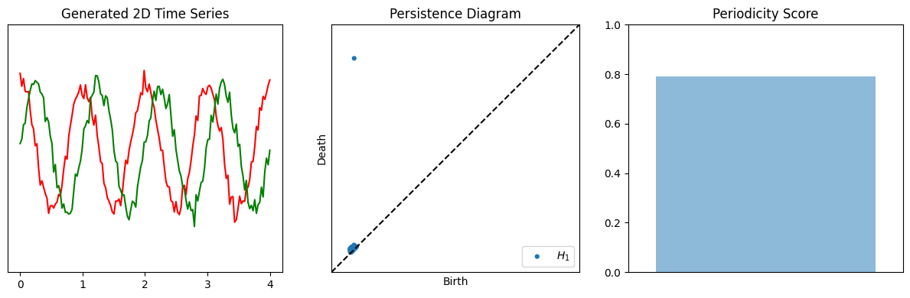

# AQSM-SW1PerS: Automated Quantification of Stereotypical Motor Movements via Sliding Windows and 1-Persistence Scoring

This repository contains code, models, and analysis tools introduced in the paper *Automated Quantification of Stereotypical Motor Movements in Autism Using Pose and Persistence* associated with the **AQSM-SW1PerS** algorithm, a pipeline for detecting repetitive movements using topological data analysis on pose signals.

## Table of Contents
1. [Abstract](#abstract)
2. [Installation](#installation)
3. [Project Structure](#structure)
4. [Basic Usage](#usage)
5. [Citation](#citation)

---

<a name="abstract"></a>
## Abstract

Stereotypical motor movements (SMM) are a core diagnostic feature of autism that remains difficult to quantify reliably and efficiently across individuals and developmental stages. The current paper presents a novel pipeline that leverages human pose estimation and Topological Data Analysis to quantify and characterize recurrent movement patterns in video-based data. We construct low-dimensional, interpretable feature vectors that capture geometric properties associated with autistic SMM using persistent homology and extracting periodic structure from time series derived from body landmarks. We demonstrate that these features, combined with simple classifiers, enable the accurate automated classification of SMM. Visualization of the learned feature space reveals that the extracted features generalize across individuals and are not dominated by person-specific SMM. Our results highlight the potential of using mathematically principled features to support scalable, interpretable, and person-agnostic detection of autistic SMM in naturalistic settings.

---

<a name="installation"></a>
## Installation

### Requirements
- Windows / Linux / macOS
- Python 3.11
- PyTorch 2.1.0 (with CUDA 11.8 for GPU support)

### Install via pip
```bash
pip install git+https://github.com/ambaye15/AQSM_SW1PerS.git
```

> Please install PyTorch manually using: [https://pytorch.org/get-started/locally](https://pytorch.org/get-started/locally)

### Pose Estimation
- MediaPipe is automatically installed via `requirements.txt`. For more information on MediaPipe and its other solutions: [https://ai.google.dev/edge/mediapipe/solutions/guide](https://ai.google.dev/edge/mediapipe/solutions/guide)

---

### Data Downloads

You can download the following data (link coming soon):
- `dataset.pkl` – Contains preprocessed MediaPipe keypoints, annotations, frame rate, and video metadata.
- `YOLOv5l.zip` – Trained weights and metadata for bounding box inference.

> Please install Dataset: [Dataset link]()

---

<a name="structure"></a>
## Project Structure

```
AQSM_SW1PerS/
├── SW1PerS.py               # Core script for persistence scoring
├── mediapipe_pose.py        # Pose extraction pipeline (YOLO + MediaPipe)
├── utils/
|   ├── accelerometer.py     # Tools for the accompyaning accelerometer data
│   ├── create_pkl.py        # Construct `dataset.pkl` for the pipeline  # Keypoint smoothing, extraction from pkl
│   ├── data_processing.py   # Keypoint smoothing, extraction from pkl
|   ├── paths.py             # Acess contents of 'Dataset' directory from any other directory
|   ├── period_estimation.py # Tools to estimate period of multivariate time series
│   └── video_tools.py       # Load annotations, read and write videos from Goodwin et al. (2014)
classification_tools/        # Model training, evaluation scripts
notebooks/                   # Demos, tutorials, reproducible figures
scripts/                     # Batch processing and automation scripts
tests/                       # Test script to verify installation
docs/                        # In depth instreuction of dataset
Dataset/                     # Must download
Visualizations/              # Directory to save images
```

---

<a name="usage"></a>
## Basic Usage

Run the included test suite to verify installation:

```bash
python -m unittest tests/test_periodicity.py
```

Here is a simple demo of a periodic 2D signal with its persistence diagram and periodicity score:

```python
from AQSM_SW1PerS.SW1PerS import *
from AQSM_SW1PerS.utils.period_estimation import *
from persim import plot_diagrams
import matplotlib.pyplot as plt
import numpy as np

t_vals = np.linspace(0, 4, 150)
sampling_rate = 150 / 4
x = np.cos(2 * np.pi * t_vals)
y = np.sin(2 * np.pi * t_vals)
X = np.column_stack((x, y)) + np.random.normal(scale=0.1, size=(150, 2))

period_estimator = PeriodEstimator(sampling_rate, num_components = 2, f_min = 0.5, f_max = 2.0, window_size = 4.0)
period = period_estimator.estimate_period(X)

d = 23
tau = period / (d + 1)
spline = [CubicSpline(t_vals, X[:, 0]), CubicSpline(t_vals, X[:, 1])]
SW = SW_cloud_nD(spline, t_vals, tau, d, 300, 2)

diagrams = ripser(SW, coeff=next_prime(2 * d), maxdim=1)['dgms']
score = compute_PS(np.array(diagrams[1]), method='PS1')

fig, (ax1, ax2, ax3) = plt.subplots(1, 3, figsize=(12, 4))
ax1.plot(t_vals, X[:, 0], label='X'); ax1.plot(t_vals, X[:, 1], label='Y')
ax1.set_title("2D Time Series"); ax1.set_yticks([]); ax1.axis("equal")

plot_diagrams(diagrams, plot_only=[1], ax=ax2)
ax2.set_title("Persistence Diagram"); ax2.set_xticks([]); ax2.set_yticks([])

ax3.bar(range(1), score, alpha=0.5)
ax3.set_title("Periodicity Score"); ax3.set_ylim(0, 1); ax3.set_xticks([])

plt.tight_layout()
plt.show()
```



---

<a name="citation"></a>
## Citation

If you use this package in your work, please cite the repository (DOI coming soon). BibTeX and publication link will be included here.

---
